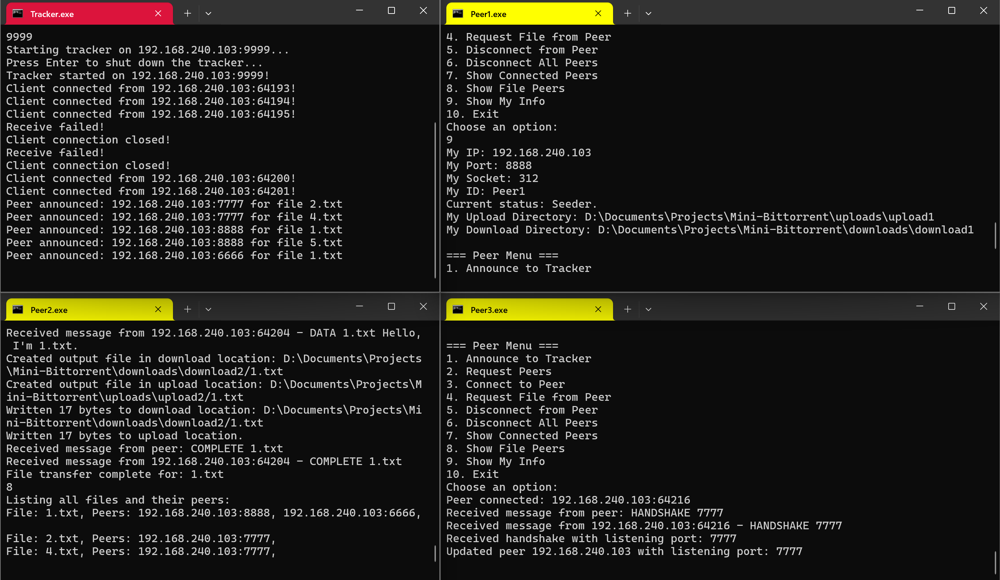
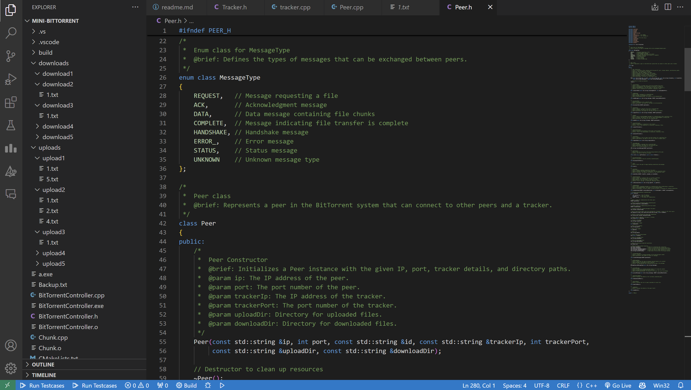

# Mini BitTorrent

## Overview

I created **Mini BitTorrent**, a lightweight implementation of the BitTorrent protocol that allows users to share files efficiently over a peer-to-peer network. This project includes a **Tracker** that manages active peers and their shared files, as well as **Peer** instances that can connect to the tracker and to each other to exchange files.

My goal with this project was to provide a simple yet effective way to understand how BitTorrent works while showcasing essential concepts in networking and multithreading.

## Features

- **Peer Management:** Functionality to track peers that share specific files.
- **File Sharing:** Peers can announce the files they have and request files from other peers.
- **Thread Safety:** I used mutexes and atomic flags to ensure safe access to shared resources in a multithreaded environment.
- **Error Handling:** Basic error handling to manage socket and connection issues.

## Tracker Class

The `Tracker` class is responsible for managing connections with peers and facilitating file sharing. Here are its main functionalities:

- **Initialization and Setup:**
  - Initializes the tracker with a specified IP address and port number.
  - The tracker creates a socket to listen for incoming connections.

- **Client Handling:**
  - Handles multiple peer connections concurrently using threads.
  - The tracker processes incoming requests from peers, such as announcing files or requesting peer information.

- **Peer Management:**
  - Maintains a map of files and the peers that have them, allowing peers to request a list of available peers for specific files.

- **Shutdown Procedures:**
  - The tracker gracefully shuts down, ensuring all threads are terminated.

### Key Methods
- `init()`: Initializes the tracker by creating a socket.
- `start()`: Begins listening for incoming connections.
- `handleClient()`: Manages communication with a single peer.
- `announcePeer()`: Handles announcements of files by peers.
- `sendPeersList()`: Sends a list of peers that have a requested file to the requesting peer.

## Peer Class

The `Peer` class represents an individual node in the BitTorrent network. Each peer can connect to the tracker and other peers to share files. Key functionalities include:

- **Connection Management:**
  - Connects to the tracker and other peers to exchange files.
  - Peers send and receive messages, including file requests and acknowledgments.

- **File Handling:**
  - Peers can request specific files from connected peers.
  - Keeps track of which files are available from other peers.

- **Multithreading:**
  - Listens for incoming messages on separate threads to handle multiple connections efficiently.

### Key Methods
- `connectToTracker()`: Establishes a connection to the tracker.
- `announceToTracker()`: Informs the tracker about the files the peer has.
- `requestPeers()`: Requests a list of peers sharing a specific file from the tracker.
- `handlePeer()`: Manages incoming connections from other peers.

## Usage

1. Clone the repository:
   ```
   git clone https://github.com/ArpitRawat07/Mini-BitTorent.git
   cd Mini-BitTorent
   ```
2. Compile and run the appplication as follows:

**Tracker**
```
g++ -o <TrackerID> Tracker.cpp -lws2_32
<TrackerID>.exe
```

**Peer**
```
g++ -o <PeerID> Peer.cpp -lws2_32
<PeerID>.exe
```

### Note

- Associate an upload and a download folder with every peer (these paths are required later while running).
- The text files that a peer owns should be kept in the upload folder (if a peer has any file to share, it is categorized as a seeder; otherwise, it is categorized as a leecher). 
- The text files requested from another peer will be downloaded to your designated download location.
- If you are using a single system, use the IP of your system, and for every entity, use a different port and ID.

## Contributions

If you would like to contribute to this project, feel free to fork the repository and submit a pull request. Any improvements, bug fixes, or new features are welcome!
